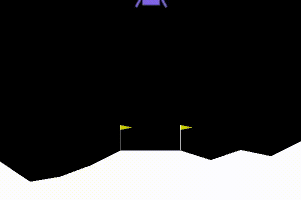

# Mini Projet 4 IAT : Deep Reinforcement Learning

Pendant les cours d'IAT (Intelligence Artificielle pour les Télécoms), nous avons abordé les approches d'apprentissage par renforcement à travers les cours de Jilles DIBANGOYE et les travaux dirigés de Mathieu GOUTAY. 

Ces approches, notamment avec le **Q-Learning** permettent d'apprendre les actions à prendre, à partir d'expériences, de façon à optimiser une récompense quantitative au cours du temps. 

L'agent est plongé au sein d'un *environnement*, et prend ses décisions en fonction de son *état courant* afin de **maximiser l'espérance** des *gains* futurs.

## Enoncé du problème

Le but de ce projet est de faire atterrir une fusée sur la lune en contrôlant ses moteurs.

<p style = text-align:center;>
    
</p>

L'environnement est donné par [gym](https://gym.openai.com/) avec [LunarLander-v2](https://gym.openai.com/envs/LunarLander-v2/) et intègre déjà le système de récompense (rewards) de nos actions.

La modélisation du problème est faite ainsi :

- *state* composé des valeurs définissant un état précis du vaisseau 
  - position / vitesse / angle / vitesse d'angle / détection de collision
- *actions* définit les 4 actions possibles
  - ne rien faire / allumer moteur gauche / allumer moteur droit / allumer moteur principal
- *reward* est la récompense reçue après réalisation d'un action depuis un état donné.

L'objectif de l'apprentissage est donc de *prédire* la meilleure action à réaliser (i.e. qui permet de maximiser le total des reward) compte tenu du *state* actuel.

# Idée générale 

Le processus général d'apprentissage se déroule comme suit pendant ```nb_episodes```  (tentative d'atterrissage dans notre cas) pendant lesquelles on fait au maximum  ```nb_steps``` fois le cycle

1. Récupérer state actuel
2. Prédire une action
3. Réaliser l'action dans l'environnement
4. Récupérer le *reward* et nouveau state
5. Améliorer le modèle de prédiction connaissant ancien state/action effectuée/nouveau state/reward

```python
for episode in range(nb_episodes):

    env.reset() # reset simulation before retrying landing
    state = env.sense()	# retrieve initial state
    
    for step in range(nb_steps):
        
        # predict best action according to state 
        action = predict(state)
        
        # apply action in the simulation
        # retrieve the new state/reward/boolean isDone
        next_state, reward, done = env.step(action)
        
        # insert a new record in history
        insert_history(state, action, reward, next_state, done)
        
        state = next_state # store new state
        
        # retrieve random samples from history
        samples = get_batch_from_history(batch_size)
        
        # fit model with these new samples
        learn(samples)
        
        if done:
            break;
```

# Approche DQN

L'approche classique de Q-Learning consiste à stocker le *reward* obtenu pour chaque action et état possible du système et ainsi permettre, pour un état donné, d'indiquer l'action qui permet d'obtenir le *reward* le plus grand.

Dans notre cas, les possibilités d'états sont très grandes avec dans le vecteur *state* les coordonnées (x,y) du vaisseaux, sa vitesse etc. Il faudrait également atteindre touts les états possibles du système ce qui est très **coûteux** en temps de **calcul** et en **mémoire**.

Ainsi, pour ses propriétés d'apprentissage, de généralisation et d'extrapolation on peut utiliser les Deep Neural Network afin d'apprendre sur des ensembles d'exemples parmi l'historique.

Le DQN consiste donc en l'utilisation d'un réseau d'apprentissage profond pour approximer la fonction Q

Ici on utilise un réseau à 3 couches :

```python
#Create and initialize the online DQN
	self.DQN_online = tf.keras.models.Sequential([
		Dense(512, activation='relu'),
        Dense(256, activation='relu'),
        Dense(self.nb_actions, activation='linear')
    ])
    
    #Build the model to create the weights
    self.DQN_online.build(input_shape=(None, self.state_size)) 
    self.DQN_online.compile(loss='mse',		   		 optimizer=tf.keras.optimizers.Adam(self.learning_rate))
```

Les 3 couches sont fully-connected : les neurones de deux couches successives sont tous interconnectés entre eux. 

Les deux première utilisent la fonction d'activation *relu* qui ajoute la **non-linéarité** nécessaire du réseau de neurones (NN).

On utilise l'optimizer *Adam* qui permet d'ajuster le learning rate ainsi d'obtenir un meilleur entraînement que la descente de gradient stochastique classique. Il rend ainsi l'apprentissage plus efficace dans le cas d'un réseau entraîne de manière *online* : on entraine par étape sur des petits batch (64 échantillons dans notre cas).

### Epsilon-greedy policy

Cette politique permet de garantir, en début d'apprentissage, une bonne capacité d'**exploration** en ayant une **forte probabilité** de choisir notre action au **hasard**  puis de diminuer cette probabilité jusqu'à une valeur minimum.

Conserver une probabilité non nulle de choisir notre action au hasard permet de casser les situations de **symétrie** et d'obtenir une légère variabilité dans la réponse de notre système à un même environnement.

```python
if np.random.rand() < self.epsilon:
    return np.random.randint(low=0, high=self.nb_actions)
 
actions = self.DQN_online(state)
return np.argmax(actions)
```

### Target

Afin d'entrainer notre NN, on procède comme suit

1. On prédit avec le réseau actuel la meilleure q-value : le reward max que l'on peut espérer parmi toutes les actions possibles

```python
pred_q_values = self.DQN_online(new_states_vec)
max_pred_q_values = np.amax(pred_q_values, axis=1)
```

2. La nouvelle target est calculée à partir de l'équation d'optimalité de Bellman  :

<p style = text-align:center;>
   
</p>

   On obtient par la suite

<p style = text-align:center;>
   
</p>

```python
targets = rewards + self.gamma * (max_pred_q_values) * (1 - end_boolean)
target_vec = self.DQN_online(states_vec)
```


## Résultats

En entraînant 1 step sur 5 avec 1000 steps par épisodes, j'ai obtenu le résultat suivant :


On peut remarquer :

- l'entraînant n'est pas stable : la target change et on essaie de prédire dessus, cela introduit des instabilités qui pourraient être résolues (voir section suivante)
- Au bout de 500 épisodes on obtient un reward tout à fait acceptable qui correspond à un atterrissage rapide du vaisseau sur la lune (voir vidéo et Jupyter notebook joints)

## Pistes d'amélioration

Beaucoup de pistes restent à explorer afin d'obtenir de meilleurs résultats 

- Essayer de nouvelles structures pour notre modèle
- utiliser un réseau de neurone offline pour servir de target et mettre à jour ses poids à partir de ceux du réseau online à intervalle régulier (tentative vaine, le réseau online ne convergeait pas...)

## Sources

Le repo GitHub de Mathieu Goutay traitant du RL https://github.com/mgoutay/ml_course

Un article de towards science traitant du DQN avec gym https://towardsdatascience.com/welcome-to-deep-reinforcement-learning-part-1-dqn-c3cab4d41b6b

